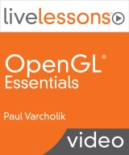

###Overview

This is the source code repository for the video series *OpenGL Essentials LiveLessons* by Paul Varcholik.

[](http://my.safaribooksonline.com/video/programming/opengl/9780133824360)

###Prerequisites
* Windows
    * Windows 10
    * Visual Studio 2019 or newer

* Linux
    * [CMake](https://cmake.org/)

###Quick Start (Win32 latest)

Retrieve this repository:
```
> git clone https://bitbucket.org/pvarcholik/opengl-essentials-livelessons.git
```

Install vcpkg ([additional detail](https://github.com/microsoft/vcpkg)):
```
> git clone https://github.com/Microsoft/vcpkg.git
> cd vcpkg
> .\bootstrap-vcpkg.bat
> vcpkg integrate install
```

Install dependencies (assuming default triplet of x86-windows):
```
> vcpkg install ms-gsl gl3w glfw3 glm assimp soil
> vcpkg install ms-gsl:x64-windows gl3w:x64-windows glfw3:x64-windows glm:x64-windows assimp:x64-windows soil:x64-windows
```

Open the OpenGL.sln file (within the build directory) in Visual Studio and enjoy!

###Quick Start (Linux latest)

Linux environment setup:
````
(You may need to install any or all of the following packages.)
> sudo apt install build-essential g++ xorg-dev libx11-dev libxinerama-dev libxcursor-dev mesa-common-dev mesa-utils
````

Retrieve this repository:
```
> mkdir dev && cd dev
> git clone https://bitbucket.org/pvarcholik/opengl-essentials-livelessons.git
```

Install vcpkg ([additional detail](https://github.com/microsoft/vcpkg)) and dependencies:
```
> git clone https://github.com/Microsoft/vcpkg.git
> cd vcpkg
> ./bootstrap-vcpkg.sh
> ./vcpkg install ms-gsl gl3w glfw3 glm assimp soil
> export VCPKG_ROOT=~/dev/vcpkg  (consider adding this to your .bash_aliases file)
```

Build
```
> cd ../opengl-essentials-livelessons/build
> cmake ..
(alternatively, you can invoke "cmake -DCMAKE_TOOLCHAIN_FILE=~/dev/vcpkg/scripts/buildsystems/vcpkg.cmake .." if you don't want to export the VCPKG_ROOT variable) 
> make
(produces binaries under opengl-essentials-livelessonsbuild/source/Lesson*)
```

###Using Older versions

Retrieve this repository:
```
> git clone https://bitbucket.org/pvarcholik/opengl-essentials-livelessons.git
> cd opengl-essentials-livelessons
> git checkout <tagname> (see list of tags below. e.g. git checkout v1.0)
```

###Tags
* v1.0 - 4/25/2014 - Original code published with the lessons (Visual Studio 2013 projects)
* v2.0 - 7/1/2016 - Significant refactoring (Visual Studio 2015 projects)
    * NuGet packages
    * Pre-compiled headers
    * Project references to the Library project
    * NuGet projects for glfw, glm, and assimp
    * Increased warning level (and now treating warnings as errors)
    * More C++11 usage
    * Replaced most raw pointers with smart pointers
    * Additional refactoring for [C++ Core Guidelines](https://github.com/isocpp/CppCoreGuidelines/blob/master/CppCoreGuidelines.md) 
* v3.0 - 5/8/2019
    * Visual Studio 2019 projects
    * [vcpkg](https://github.com/microsoft/vcpkg) for dependencies
    * x64 configurations
    * Refactoring for reduced code duplication and reduced platform dependencies
    * CMake project configuration and Linux support

###Library Dependencies

* [GLFW](https://www.glfw.org/) - OpenGL Framework
* [GL3W](https://github.com/skaslev/gl3w) - Simple OpenGL core profile loading
* [GSL](https://github.com/Microsoft/GSL) - Guidlines Support Library (Microsoft)
* [Assimp](http://www.assimp.org/) - Open Asset Import Library
* [GLM](https://glm.g-truc.net/0.9.9/index.html) - OpenGL Mathematics
* [SOIL](https://github.com/littlstar/soil) - Simple OpenGL Image Library